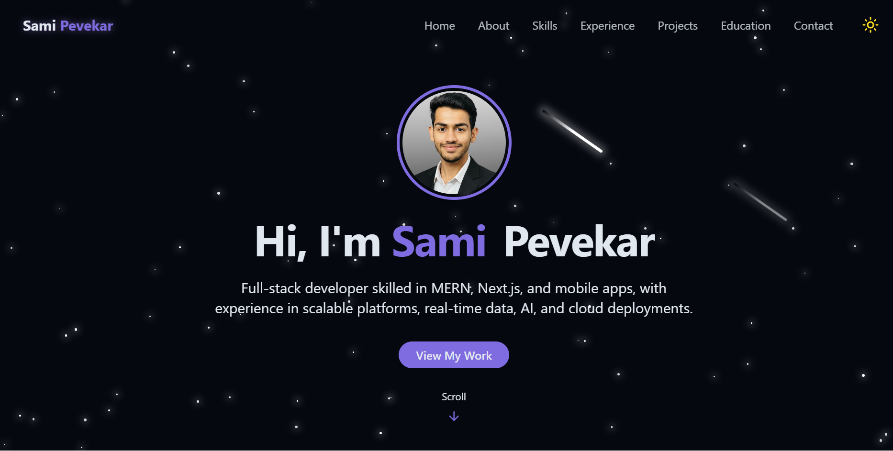

# 🌐 My Portfolio

This is my personal developer portfolio built with **React, Next.js, and TailwindCSS**.  
It showcases my **projects, skills, and experiences** with a modern and responsive UI.

---

## 🚀 Features

- 🎨 **Modern UI/UX** with TailwindCSS + ShadCN UI  
- 🖼️ Projects section with live demo & GitHub links  
- 💼 Experience section with internship details & certificates  
- 🛠️ Skills section (Languages, Frontend, Backend, Databases, Tools)  
- 📱 Fully responsive design for all devices  
- ☁️ Deployed on **Vercel** for fast performance  


---

## 📸 Screenshots


---
## ⚡ Getting Started

Follow these steps to run locally:

```bash
# Clone the repo
git clone https://github.com/samipevekar/my-portfolio.git

# Navigate to folder
cd my-portfolio

# Install dependencies
npm install

# Start development server
npm run dev
```

## 📬 Contact Me

### Portfolio: 

### GitHub: https://github.com/samipevekar

### LinkedIn: https://www.linkedin.com/in/sami-pevekar-b90a742b8